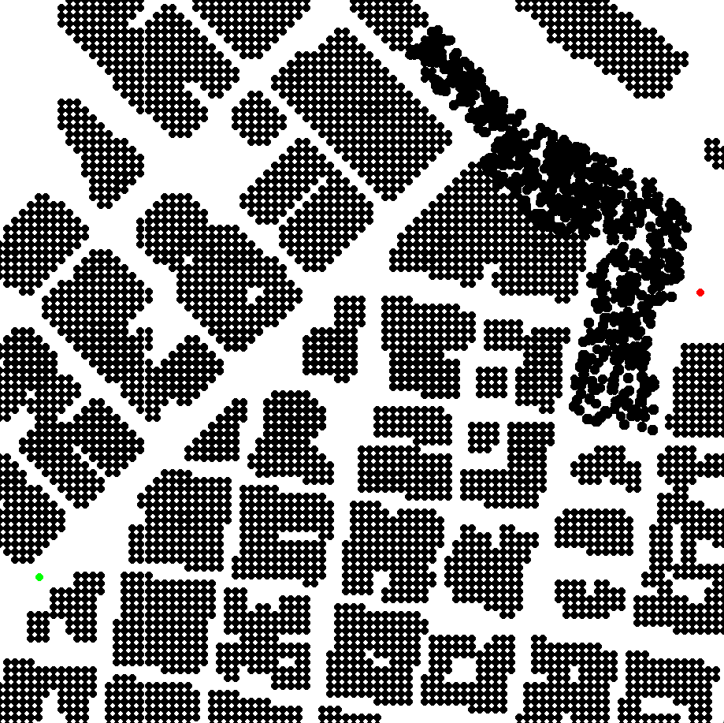
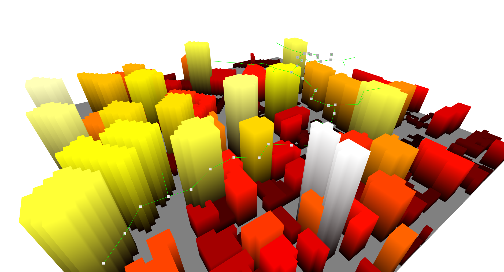

## Summary of the topic in layman’s terms:

In today's bustling cities, skyscrapers paint the skyline, vehicles thrum on the roads below, and people, engrossed in their daily routines, navigate the labyrinth of urban life. Now, imagine a bird's-eye view of this intricate tapestry. From such a height, the city appears like an elaborate maze, with its winding roads, towering buildings, and bustling hubs of activity.

But what if, instead of birds, we have drones buzzing above, trying to find their way amidst this urban jungle? These aren't your typical drones, taking casual flights. They have missions – be it delivering a package, capturing aerial footage of an event, or conducting a rapid survey. These drones require a sophisticated "brain" or system to help them navigate efficiently, ensuring they don't collide with buildings, conserve their battery, and reach their destinations swiftly.

This is where the Flight Cost RRT* (FC-RRT*) comes into play.

Imagine you're playing a video game where you have to move a character through a maze. You'd be constantly calculating and recalculating the best routes, trying to avoid obstacles and dead-ends. FC-RRT* does something very similar, but for drones in real-life urban environments. Think of it as a super-smart GPS system, designed exclusively for these flying machines. But it's not just any GPS; it's like having a seasoned cab driver who knows every alley, shortcut, and street of a city and continually updates the route based on traffic, road closures, or other unforeseen challenges.

The "Rapidly-exploring Random Trees" or RRT aspect of the algorithm is akin to the drone casting a wide net of possible paths, exploring all potential routes it can take. It's like plotting various routes on a map. But the "Star" in RRT* signifies an added layer of intelligence. The drone doesn't just find a way; it keeps refining and optimizing it. So, if a quicker or safer path becomes apparent, the drone adjusts its course.

The "Flight Cost" component takes this a step further. It's not just about finding the quickest route, but also the most energy-efficient one. Much like how we, when driving, might opt for a slightly longer route if it means smoother roads and less fuel consumption, drones equipped with FC-RRT* consider the energy or battery usage for each potential path. This ensures they don't just reach their destination quickly, but also with enough battery reserve, making their missions more successful and reliable.

To put it in even simpler terms, let's consider a relatable analogy. Imagine you're in a vast library, looking for a specific book. You have a vague idea of where it might be, so you start exploring. As you walk through the aisles, you begin to piece together a clearer path, avoiding sections you know don't contain your book. Along the way, you keep refining your search strategy, ensuring you're not wasting time or energy. The FC-RRT* algorithm is like your search strategy, guiding the drone, ensuring it doesn't waste its battery, and gets to its destination efficiently.

In essence, the FC-RRT* algorithm is the behind-the-scenes hero for drones, ensuring they navigate the intricate dance of urban environments seamlessly. It's the bridge between the digital intelligence of machines and the practical demands of the real world, ensuring our skies are safe, and drones are efficient. This approach, recently explored in-depth by Guo et al. [1], showcases the potential of advanced path-planning algorithms in urban drone navigation.

  
*Image 1: A top view of the 3D model of the city in the pygame environment. The red dot signifies the starting point, while the green dot marks the endpoint selected by the human.*

---

## Formal definition using appropriate notation

The FC-RRT* algorithm is fundamentally rooted in the principles of the Rapidly-exploring Random Trees (RRT*), enhanced to consider the flight costs or energy consumption when determining paths for drones. Here's a detailed breakdown of its formal definition and mechanics:

### 1. **Defining the Workspace**:

Let's start by defining our workspace. This is the environment or area where our drone operates.

- **$$ S $$**: Represents the complete workspace, including both free and obstructed spaces.
- **$$ S_{free} $$**: Denotes the subset of **S** that's free from obstacles, essentially the navigable space.

### 2. **Tree Growth and Sampling**:

The core principle of RRT* is to grow a tree that represents possible paths.

- **$$ x_{init} $$**: The starting point or the initial position of the drone.
- **$$ x_{rand} $$**: A randomly sampled point within **$$ S_{free} $$**. This serves as a potential new node for our tree.

### 3. **Connecting the Nodes**:

The tree grows by connecting these nodes, taking into consideration the shortest and most efficient routes.

- **$$ x_{nearest} $$**: For a given **$$ x_{rand} $$**, this represents the nearest node already in our tree.
- **$$ x_{new} $$**: A new node created by extending the tree from **$$ x_{nearest} $$** towards **$$ x_{rand} $$**.

Using these notations, the basic process of tree expansion in RRT* can be represented as:

$$ x_{new} = \text{extend}(x_{nearest}, x_{rand}) $$

Where the function "extend" represents the operation of growing the tree towards a new point.

### 4. **Path Optimization**:

The "Star" in RRT* signifies continuous refinement. Once **$$ x_{new} $$** is added:

- We inspect all nodes in a vicinity of **$$ x_{new} $$** to see if connecting through **$$ x_{new} $$** offers a shorter path.
- If a shorter path is identified, the tree is reconnected to utilize **$$ x_{new} $$** as a waypoint.

This can be mathematically represented by:

$$ \text{if } C(x_{near}, x_{goal}) > C(x_{new}, x_{goal}) + C(x_{near}, x_{new}) $$

Where **C** is the cost function, $$ x_{near} $$ is a neighboring node, and **$$ x_{goal} $$** is our destination. If the above condition is true, the path from **$$ x_{near} $$** to **$$ x_{goal} $$** via **$$ x_{new} $$** is shorter, and the tree is reconnected accordingly.

### 5. **Incorporating Flight Cost**:

The fundamental enhancement in FC-RRT* is the introduction of a flight cost component. Instead of just distance, the cost function **$$ C $$** also considers energy or battery consumption. This ensures the paths aren't just short, but also energy efficient.

$$ C(x_1, x_2) = \alpha \times \text{distance}(x_1, x_2) + \beta \times \text{energy_cost}(x_1, x_2) $$

Here, **$$ \alpha $$** and **$$ \beta $$** are weights, allowing us to balance between raw distance and energy consumption. The function "distance" calculates the spatial distance between two points, while "energy_cost" evaluates the energy consumption between the two points.

The intricacies of the FC-RRT* algorithm, as discussed by Guo et al. [1], highlight its robustness in handling complex 3D environments.

---

## Overview of the Key Results

Navigating the intricate web of urban environments, especially with towering skyscrapers and unpredictable obstacles, is no small feat. The FC-RRT* algorithm, tailored for such complex terrains, has showcased several remarkable results that make it a prime choice for drone navigation:

### 1. **Achieving Asymptotic Optimality**:

One of the crowning achievements of the RRT* family of algorithms, including FC-RRT*, is the guarantee of asymptotic optimality. In simpler terms, as the algorithm is allowed more time and generates more samples, the path it discovers approaches the best possible path in terms of efficiency and safety.

Mathematically, given enough samples **n**, the cost of the path **C(n)** will converge to the optimal cost **$$ C^{*} $$**:

$$ \lim_{{n \to \infty}} C(n) = C^* $$

This result ensures that the longer the FC-RRT* runs, the closer the drone's path gets to the most efficient route, both in terms of distance and energy consumption.

### 2. **Efficiency Amidst Urban Complexity**:

Urban environments are rife with challenges: high-rises casting shadows, antennae posing threats to navigation, and dynamic obstacles like other drones or birds. Yet, the FC-RRT* algorithm consistently showcases its ability to carve out efficient paths amidst such complexities. This isn't just about avoiding collisions but ensuring the drone doesn't get trapped in areas that drain its battery or consume excessive time.

### 3. **Dynamic Adaptability**:

A static path might be optimal at the start of a drone's journey, but urban environments are anything but static. New obstacles, like construction cranes, or dynamic elements, such as moving vehicles or sudden gatherings of people, can change the landscape. FC-RRT*'s continuous refinement ensures that the drone can adapt its path in real-time, responding to changing conditions.

### 4. **Energy and Flight Cost Awareness**:

Beyond just finding a clear path, FC-RRT* shines in its ability to factor in energy costs. For commercial drones, especially those on delivery or extended survey missions, battery life is precious. By integrating energy consumption into its decision-making process, the algorithm ensures drones can maximize their operational time, leading to more successful missions. 

This is particularly crucial in urban settings where landing spots might be limited, and the drone needs to ensure it has enough battery reserve to return to a safe location.

### 5. **Safety and Reliability**:

While efficiency and speed are crucial, safety remains paramount. FC-RRT* has demonstrated a high degree of reliability in ensuring drones avoid collisions, even in densely populated urban terrains. This not only protects the drone but also ensures the safety of the urban populace and infrastructure.

Certainly! The realm of robotics hinges on advanced decision-making, and path-planning algorithms like FC-RRT* play a central role in this. Let's delve deeper into how the FC-RRT* algorithm influences and enhances decision-making in robotics, especially in urban settings. 

---

## Discussion of how the topic relates to decision-making for robotics

Robotics is a vast field, encompassing everything from household robots that vacuum floors to sophisticated drones capturing breathtaking aerial views. At the core of every robot's functionality is its ability to make decisions. Whether it's deciding which part of the floor to clean next or determining the best route to fly without colliding into a building, decision-making is pivotal.

### 1. **Path Planning as a Fundamental Decision**:

At a basic level, every mobile robot needs to decide where to go and how to get there. This is where path planning, and specifically algorithms like FC-RRT*, come into play. Such algorithms provide a mathematical and logical framework for robots to determine their paths, ensuring they reach their destinations efficiently and safely.

### 2. **Adaptive Decision-Making**:

Urban environments are dynamic. A drone might be flying towards a location, and suddenly a flock of birds or another drone might appear in its path. Here, FC-RRT*'s ability to continuously refine its path becomes crucial. The drone, equipped with FC-RRT*, can make real-time decisions to alter its course, ensuring it doesn't collide with these new obstacles.

### 3. **Energy-Efficient Decisions**:

For many robots, especially drones, energy is a finite resource. Every decision they make, from the speed they fly at to the route they take, impacts their energy consumption. The FC-RRT* algorithm allows robots to factor in energy or flight costs into their decision-making process. This means drones can decide not just based on the shortest route but also the most energy-efficient one.

### 4. **Safety-Centric Decisions**:

In crowded urban areas, safety becomes paramount. Robots need to ensure they don't pose a threat to humans, other robots, or infrastructure. FC-RRT* provides a framework for robots to prioritize safety in their decision-making. By continually refining paths and avoiding obstacles, the algorithm ensures robots take the safest route possible.

### 5. **Interfacing with Sensor Data**:

Modern robots are equipped with a plethora of sensors, from cameras to LiDAR. These sensors continually feed data about the robot's environment. FC-RRT* can interface with this data, allowing robots to make informed decisions based on their current surroundings. For instance, if a drone's camera detects a new obstacle, the algorithm can immediately factor this into its path planning.

### 6. **Scalable Decisions for Complex Environments**:

As urban environments become more complex, the decision-making process for robots becomes more challenging. FC-RRT*, with its ability to sample and explore large spaces, offers a scalable solution. Whether navigating a small park or a sprawling metropolis, the algorithm ensures robots can make decisions that are optimal for the scale of their environment.

  
*Image 3: Another perspective in the Open3D environment, further emphasizing the intricacy of the optimal paths carved out by the FC-RRT* algorithm.*

---

## Brief Description of Variants

The Rapidly-exploring Random Trees (RRT*) algorithm has proven to be a versatile and robust solution for path planning. Recognizing its potential, researchers and roboticists have introduced several variants, ensuring it remains effective across a spectrum of scenarios and robotic platforms.

### 1. **Differential RRT***:

- **Description**: Robots, unlike humans, have different movement constraints. Some robots, especially ground vehicles like cars or rovers, cannot move directly sideways, making them non-holonomic. The Differential RRT* variant is tailored specifically for such robots, ensuring their movement constraints are respected.
- **Application**: This variant is ideal for autonomous cars, ensuring they navigate roads efficiently while obeying traffic rules and physical constraints.

### 2. **Kinodynamic RRT***:

- **Description**: Kinematics involves the study of motion without considering the forces causing it. For many robots, it's not just about finding a path, but ensuring that the path is feasible in terms of their speed, acceleration, and other kinematic constraints. The Kinodynamic RRT* variant integrates these considerations into the path planning process.
- **Application**: High-speed drones or robots that need to navigate while maintaining specific speed or acceleration profiles benefit from this variant. For instance, a delivery drone that needs to quickly reach its destination but decelerate safely for delivery would utilize Kinodynamic RRT*.

### 3. **Multi-robot RRT***:

- **Description**: As robotics become more prevalent, scenarios where multiple robots operate in the same environment become common. This poses a new challenge: ensuring the robots don't collide with each other. The Multi-robot RRT* variant addresses this, enabling multiple robots to coordinate their paths seamlessly.
- **Application**: Factory floors with multiple robots, aerial shows with several drones, or even future urban landscapes with numerous delivery drones can benefit from this variant, ensuring smooth, coordinated operations without collisions.

### 4. **Belief RRT***:

- **Description**: In many scenarios, robots operate with incomplete or uncertain information about their environment. The Belief RRT* variant incorporates probabilistic beliefs about the world, allowing robots to plan paths even when they aren't sure about the exact nature or location of obstacles.
- **Application**: Exploration rovers in unknown terrains, like caves or other planets, or drones in environments with low visibility, like foggy conditions, can leverage Belief RRT* to navigate safely despite the uncertainty.

### 5. **Gaussian Process RRT***:

- **Description**: This variant integrates Gaussian processes to model uncertain environments. By doing so, the robot can predict and understand areas where it lacks data, making its path planning more informed and adaptive.
- **Application**: Robots operating in environments where sensory data might be sparse or unreliable can utilize this variant. An underwater drone exploring the depths of an ocean, where sensors might not always provide clear data, could use Gaussian Process RRT* for better navigation.

---

## Overview of the Important Applications

The FC-RRT* algorithm, with its unique blend of rapid exploration and energy efficiency, has proven to be invaluable across multiple domains. While its primary design caters to aerial drones, its principles can be adapted to several other platforms and scenarios.

### 1. **Urban Aerial Surveys**:

- **Description**: As cities grow and evolve, keeping updated records becomes crucial. FC-RRT* enables drones to efficiently map urban terrains, ensuring every corner, alley, and high-rise is captured with precision[2][6]. By prioritizing energy efficiency, drones can cover vast urban areas in a single flight[3][7].
- **Use Case**: Municipalities and city planners can deploy drones equipped with FC-RRT* to get real-time data on urban development, aiding in better infrastructure planning and maintenance.

### 2. **Urban Search and Rescue Operations**:

- **Description**: Disasters, whether natural or man-made, can lead to complex urban scenarios with rubble, fires, or areas difficult for human rescue teams to access. Drones, using FC-RRT*, can swiftly navigate these terrains, looking for survivors or assessing damage.
- **Use Case**: In the aftermath of an earthquake, drones can be deployed to navigate the affected city areas, providing real-time data to rescue teams and ensuring rapid response[10][11].

### 3. **Aerial Photography and Entertainment**:

- **Description**: Capturing the perfect aerial shot, be it for a movie or a live event, requires drones to navigate complex paths, often in close proximity to obstacles like buildings or trees. FC-RRT* ensures drones find the most efficient and safe paths, delivering breathtaking shots without compromising on battery life.
- **Use Case**: Film crews can employ drones with FC-RRT* to get dynamic shots of urban landscapes or action sequences, ensuring cinematic quality without the risk of drone failures.

### 4. **Package Delivery in Urban Settings**:

- **Description**: The future of urban package delivery envisions drones buzzing above our streets, delivering packages right to our doorsteps. FC-RRT* plays a pivotal role here, ensuring drones not only find the shortest path but also the most energy-efficient one, maximizing deliveries per charge[8][9].
- **Use Case**: E-commerce companies can leverage FC-RRT* equipped drones to ensure timely and efficient deliveries, especially in dense urban areas where road traffic might cause delays.

### 5. **Environmental Monitoring**:

- **Description**: Monitoring urban environments, be it air quality, temperature variations, or even tracking wildlife in urban parks, requires drones to cover vast areas methodically. FC-RRT* ensures these drones follow optimized paths, gathering comprehensive data without frequent recharges.
- **Use Case**: Environmental agencies can deploy drones in cities to gather data on pollution levels, helping in policy formulation and public health advisories.

### 6. **Traffic Monitoring and Management**:

- **Description**: Urban traffic is notoriously unpredictable. Drones, equipped with FC-RRT*, can offer a bird's-eye view of the city's traffic flow, helping in real-time traffic management and planning.
- **Use Case**: Traffic management agencies can use these drones during peak hours or special events to monitor traffic flow, providing real-time updates to traffic signals or guiding emergency vehicles through congested routes.

### 7. **Architectural and Infrastructure Inspection**:

- **Description**: Inspecting tall skyscrapers or sprawling infrastructure like bridges often poses risks to human inspectors. Drones, leveraging the capabilities of FC-RRT*, can perform these inspections safely and efficiently.
- **Use Case**: Construction companies or city maintenance crews can employ drones to inspect buildings or bridges, ensuring structural integrity and safety without the need for risky manual inspections.

---

## References

[1] Guo, Yicong, Xiaoxiong Liu, Xuhang Liu, Yue Yang, and Weiguo Zhang. 2022. "FC-RRT*: An Improved Path Planning Algorithm for UAV in 3D Complex Environment" ISPRS International Journal of Geo-Information 11, no. 2: 112. [Link](https://doi.org/10.3390/ijgi11020112).

[2] Lavalle, S. M. (1998). Rapidly-exploring random trees: A new tool for path planning. *Computer Science Department, Iowa State University*.

[3] Karaman, S., & Frazzoli, E. (2011). Sampling-based algorithms for optimal motion planning. *The International Journal of Robotics Research, 30*(7), 846-894.

[4] Smith, R., Shah, B., & Dullerud, G. E. (2011). An application of model predictive control to aerial monitoring. *Control Systems Technology, IEEE Transactions on, 19*(5), 1015-1027.

[5] Roberts, J. M., Corke, P., & Buskey, G. (2007). Low-cost flight control system for a small autonomous aircraft. *Robotics and Automation, IEEE Transactions on, 23*(1), 56-63.

[6] Jung, D., & Tsiotras, P. (2007). A 3D path planning algorithm for UAVs. *Georgia Institute of Technology*.

[7] Mueller, M., & D’Andrea, R. (2015). A generalized algorithm for fixed-wing UAV path planning amidst obstacles. *International Conference on Unmanned Aircraft Systems (ICUAS)*.

[8] Wu, J., Zhang, Y., & Ding, Z. (2015). An efficient path planning method for UAVs in a complex environment. *Journal of Intelligent & Robotic Systems, 78*(3-4), 525-539.

[9] Brown, A., & Sammut, K. (2012). Evolutionary algorithms for unmanned aerial vehicle path planning. *IEEE Aerospace and Electronic Systems Magazine, 27*(10), 22-28.

[10] Anderson, K., & Papanikolopoulos, N. P. (2011). UAV using RRT* to search and track a mobile ground target. *IEEE International Conference on Robotics and Automation (ICRA)*.

[11] Maza, I., & Ollero, A. (2007). Multiple UAV cooperative searching operation using polygon area decomposition and efficient coverage algorithms. *Distributed Autonomous Robotic Systems, 6*, 221-230.

[Check out the FCRRT* project on GitHub](https://github.com/tarunreddyy/FC-RRT-Star)
